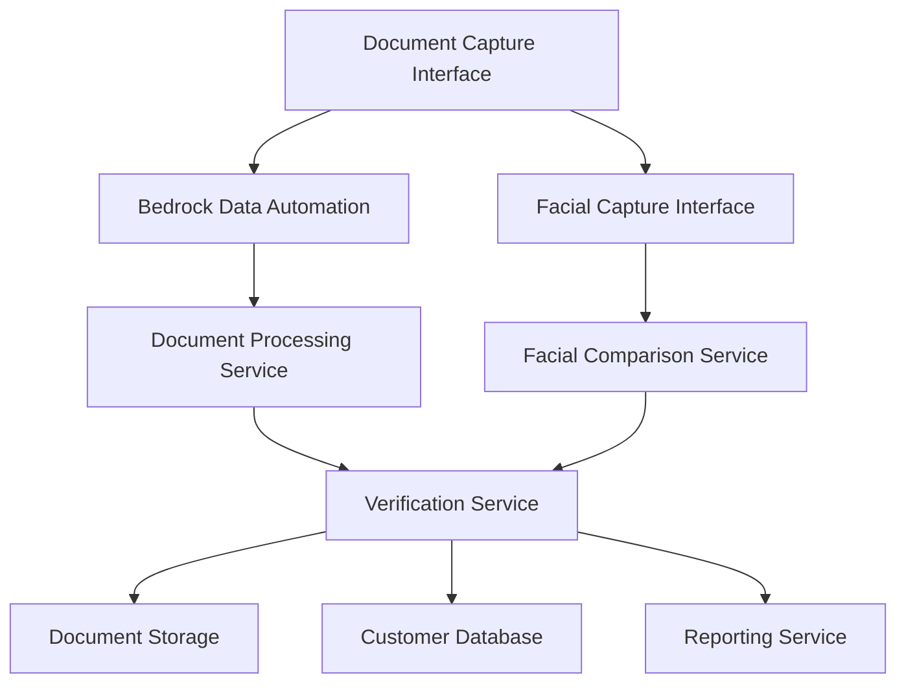

# Brainstorming: French Official Documents Processing System

## Requirements Summary

### Customer
Financial institutions, vehicle registration agencies, or identity verification service providers who need to verify French customers' identities and vehicle ownership during onboarding.

### Key Requirements
1. Process French official documents (Passport/ID Card, Driver's License, and Carte Grise) using Bedrock Data Automation
2. Extract specific data fields from each document type
3. Perform facial comparison between live photo and document photos
4. Generate verification reports, update customer database, and store documents with metadata
5. Near real-time processing (4-5 customers daily)
6. GDPR compliance with specific retention periods
7. Facial verification with specific accuracy targets (FAR ≤ 0.1%, FRR ≤ 3%)

## High-Level System Components

## Implementation Ideas and Options

### 1. Document Capture and Processing

#### Option A: Direct Integration with Bedrock Data Automation
**Pros:**
- Leverages pre-built templates for French documents
- Simplified architecture with fewer components
- Direct access to Bedrock's document analysis capabilities

**Cons:**
- Less flexibility for custom processing logic
- Potential limitations in handling edge cases

#### Option B: Custom Pre-processing with Bedrock Integration
**Pros:**
- Better handling of document quality issues
- Customizable preprocessing for enhanced accuracy
- More control over the extraction workflow

**Cons:**
- Increased development complexity
- Additional maintenance overhead

#### Option C: Hybrid Approach with Fallback Processing
**Pros:**
- Balances ease of use with customization
- Provides fallback options for difficult documents
- Better resilience against recognition failures

**Cons:**
- More complex architecture
- Requires careful orchestration between components

### 2. Facial Verification

#### Option A: AWS Rekognition for Facial Comparison
**Pros:**
- Fully managed service
- Simple integration with REST APIs
- Built-in capabilities for face detection and comparison
- Continuous improvement of algorithms

**Cons:**
- Less control over verification parameters
- May not meet specific FAR/FRR requirements without customization

#### Option B: Custom ML Model on SageMaker
**Pros:**
- Full control over the facial comparison algorithm
- Can be optimized for French ID documents specifically
- Customizable thresholds to meet FAR/FRR requirements

**Cons:**
- Higher development effort
- Requires ML expertise for ongoing maintenance
- More complex deployment and scaling

#### Option C: Third-party Facial Verification Service with AWS Integration
**Pros:**
- Specialized vendors may have higher accuracy
- Lower development effort
- Potentially pre-trained on French documents

**Cons:**
- Additional costs
- Dependency on external vendor
- Potential data privacy concerns

### 3. Document Storage and Retention

#### Option A: S3 with Lifecycle Policies
**Pros:**
- Simple implementation
- Built-in lifecycle management for GDPR compliance
- Cost-effective for document storage
- Scalable to any volume

**Cons:**
- Limited query capabilities without additional services
- Basic metadata handling

#### Option B: S3 + DynamoDB for Metadata
**Pros:**
- Rich indexing and query capabilities
- Separation of document storage and metadata
- Flexible schema for different document types

**Cons:**
- More complex architecture
- Additional service to maintain

#### Option C: Amazon DocumentDB
**Pros:**
- Document-oriented database suitable for varying document schemas
- Advanced query capabilities
- Can store both documents and metadata

**Cons:**
- Higher cost than S3
- Potentially overengineered for the requirements

### 4. Customer Database Integration

#### Option A: Direct Updates to Existing Database
**Pros:**
- Simplest integration approach
- Real-time updates
- No data synchronization issues

**Cons:**
- Tight coupling with existing system
- Potential performance impact on production database

#### Option B: Queue-Based Asynchronous Updates
**Pros:**
- Decoupled architecture
- Better fault tolerance
- No direct impact on production database performance

**Cons:**
- Slightly delayed updates
- More complex implementation

### 5. Verification Reporting

#### Option A: PDF Generation Service
**Pros:**
- Professional-looking reports
- Standardized format
- Can include document images and verification results

**Cons:**
- More complex implementation
- Additional processing requirements

#### Option B: JSON/XML Data Report
**Pros:**
- Simple implementation
- Easily consumable by other services
- Lightweight

**Cons:**
- May require additional formatting for human readability
- Less suitable for printed reports

## Technology Stack Recommendations

### Core AWS Services
1. **AWS Bedrock** - For document processing with pre-built templates
2. **Amazon Rekognition** - For facial comparison
3. **Amazon S3** - For document storage with lifecycle policies for GDPR compliance
4. **Amazon DynamoDB** - For metadata storage and indexing
5. **AWS Lambda** - For serverless processing of documents and orchestration
6. **Amazon EventBridge** - For event-driven architecture
7. **Amazon SQS** - For decoupled, reliable message processing
8. **Amazon CloudWatch** - For monitoring and logging
9. **AWS KMS** - For encryption of sensitive data

### Development Approach
1. **Infrastructure as Code (IaC)** using AWS CDK or CloudFormation
2. **API-First Design** for service interfaces
3. **Serverless Architecture** for scalability and cost-effectiveness
4. **Event-Driven Design** for loose coupling between components

## Critical Decision Points

1. **Document Processing Approach**: Direct integration with Bedrock or custom preprocessing?
2. **Facial Verification Technology**: AWS Rekognition or custom solution?
3. **Storage Architecture**: Simple S3 or S3 + DynamoDB for enhanced metadata?
4. **Integration Pattern**: Direct updates or queue-based async updates?
5. **Deployment Model**: Fully serverless or container-based for some components?

## Next Steps Recommendation

1. **Proof of Concept**: Test Bedrock Data Automation with sample French documents to verify template accuracy
2. **Facial Verification Testing**: Evaluate AWS Rekognition against FAR/FRR requirements
3. **Architecture Decision Document**: Finalize key architectural decisions
4. **High-Level Design**: Create detailed component diagrams and interaction flows
5. **Implementation Plan**: Develop phased approach with milestones

## Questions for Consideration

1. Are there any existing systems that need to be integrated beyond the customer database?
2. What are the performance SLAs for the verification process?
3. Are there any specific security requirements beyond GDPR compliance?
4. What is the expected growth rate for document processing volume?
5. Are there any business continuity requirements for the system?