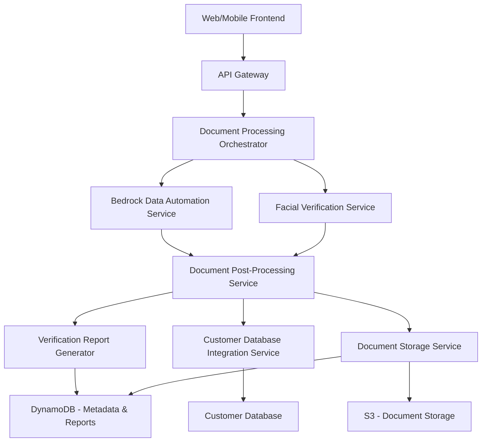

# High-Level Design: French Official Documents Processing System

## 1. Executive Summary

This document outlines the technical design for an automated French official document processing system that enables customer verification and onboarding. The system leverages AWS Bedrock Data Automation with pre-built templates to process multiple French official documents (Passport/National ID, Driver's License, and Vehicle Registration), perform facial verification, and maintain GDPR compliance.

The solution addresses the business need for efficient customer verification while handling approximately 4-5 new customers daily. Using a serverless, event-driven architecture, the system provides near real-time document processing, facial verification with specific accuracy targets, secure document storage, and integration with customer databases.

By implementing this system, the organization will reduce manual document verification efforts, improve accuracy, ensure regulatory compliance, and enhance the customer onboarding experience through faster processing times.

## 2. Strategic Context

### 2.1 Current Business Challenges

Customer onboarding and identity verification currently face several challenges:

- Manual document processing is time-consuming and error-prone
- Inconsistent extraction of information from identity documents
- Difficulty verifying the authenticity of presented documents
- Manual facial verification is subjective and potentially inaccurate
- Risk of non-compliance with GDPR regulations for document storage and processing
- Inefficient customer database updates with verified information

### 2.2 Business Drivers

The primary business drivers for implementing this system include:

- Streamlining the customer onboarding process
- Reducing operational costs associated with manual document verification
- Improving security and reducing fraud through accurate facial verification
- Ensuring consistent compliance with GDPR and other regulatory requirements
- Building customer trust through professional, efficient verification processes
- Creating a scalable foundation for future customer onboarding growth

## 3. Technical Architecture

### 3.1 Architecture Overview

The system follows a serverless, event-driven architecture using AWS services. The architecture is designed to be loosely coupled, highly scalable, and resilient.

### 3.2 Key Components

#### 3.2.1 Frontend Interface
- **Web/Mobile Interface**: Responsive interface for document uploads and facial capture
- **Authentication**: Integration with existing authentication mechanisms
- **Document Capture**: High-quality image capture with quality validation
- **Facial Capture**: Live portrait photo capture with quality checks

#### 3.2.2 Document Processing Service
- **Orchestration Layer**: AWS Step Functions to coordinate the processing workflow
- **Bedrock Data Automation Integration**: Leverages pre-built templates for French documents
- **Document Pre-processing**: Image enhancement and normalization
- **Field Extraction**: Extraction of required fields from each document type
- **Validation Logic**: Validation of extracted fields against expected formats

#### 3.2.3 Facial Verification Service
- **Image Extraction**: Extracts facial images from identity documents
- **AWS Rekognition Integration**: Performs facial comparison
- **Confidence Scoring**: Evaluates match confidence against FAR/FRR requirements
- **Manual Review Flagging**: Identifies cases requiring human verification

#### 3.2.4 Document Storage Service
- **S3 Document Repository**: Secure storage for original documents
- **Lifecycle Management**: Automatic deletion after 90 days for GDPR compliance
- **Encryption**: Server-side encryption for all stored documents
- **Access Control**: Fine-grained access policies

#### 3.2.5 Metadata Management
- **DynamoDB Metadata Store**: Indexable metadata about processed documents
- **Query Interface**: API for retrieving documents by various criteria
- **Retention Management**: Configurable retention periods for different data types

#### 3.2.6 Verification Reporting
- **Report Generator**: Creates standardized verification reports
- **Report Storage**: Maintains reports according to retention policies
- **Notification Service**: Alerts relevant personnel about verification results

#### 3.2.7 Customer Database Integration
- **Integration Service**: Updates customer records with verified information
- **Queue-based Architecture**: Ensures reliable updates without direct coupling
- **Data Transformation**: Maps extracted fields to customer database schema

### 3.3 Data Flow

1. **Document Capture**:
   - Customer presents documents
   - System captures digital images
   - Quality validation ensures usable images

2. **Document Processing**:
   - Lambda function routes documents to Bedrock Data Automation
   - Pre-built templates extract required fields
   - Validation logic ensures data quality

3. **Facial Verification**:
   - System extracts facial images from documents
   - Live portrait is captured
   - AWS Rekognition compares images
   - Results are scored against FAR/FRR thresholds

4. **Verification and Storage**:
   - Verification results are compiled
   - Documents are stored in S3 with appropriate metadata
   - DynamoDB stores searchable metadata
   - Verification report is generated

5. **Integration and Notification**:
   - Customer database is updated with verified information
   - Relevant personnel are notified of verification results
   - Audit logs are created for compliance purposes

### 3.4 Security Architecture

- **Data Encryption**: All data encrypted at rest and in transit
- **Access Controls**: Role-based access controls for all system components
- **Audit Logging**: Comprehensive logging of all operations
- **Secure API Gateway**: Authentication and authorization for all API endpoints
- **VPC Isolation**: Processing components isolated in Virtual Private Cloud
- **Least Privilege**: IAM roles with minimal required permissions
- **Data Protection**: Automatic deletion of data per GDPR requirements

## 4. Implementation Strategy

### 4.1 Development Approach

The implementation will follow an iterative, component-based approach:

1. **Phase 1: Core Document Processing**
   - Implement Bedrock Data Automation integration
   - Develop document capture interface
   - Create basic field extraction for each document type

2. **Phase 2: Facial Verification**
   - Implement facial image extraction
   - Integrate with AWS Rekognition
   - Develop confidence scoring mechanism

3. **Phase 3: Storage and Reporting**
   - Implement S3 storage with lifecycle policies
   - Create DynamoDB metadata structure
   - Develop verification reporting

4. **Phase 4: Integration and Compliance**
   - Implement customer database integration
   - Complete GDPR compliance features
   - Finalize audit logging

### 4.2 Deployment Strategy

- **Infrastructure as Code**: AWS CDK for all infrastructure components
- **CI/CD Pipeline**: Automated testing and deployment
- **Blue/Green Deployment**: For zero-downtime updates
- **Canary Releases**: Gradual rollout to detect issues early

### 4.3 Testing Strategy

- **Unit Testing**: For all service components
- **Integration Testing**: End-to-end workflow testing
- **Accuracy Testing**: Testing against known document samples
- **FAR/FRR Testing**: Specific testing of facial verification accuracy
- **Compliance Testing**: Verification of GDPR compliance features
- **Performance Testing**: Validation of near real-time processing requirements

## 5. Operational Considerations

### 5.1 Monitoring and Alerting

- **CloudWatch Dashboards**: Custom dashboards for system health
- **Log Analysis**: Centralized logging with pattern detection
- **Processing Metrics**: Tracking of document processing times
- **Accuracy Metrics**: Ongoing monitoring of facial verification accuracy
- **Alert Configuration**: Proactive alerting for system issues

### 5.2 Backup and Recovery

- **Regular Backups**: Automated backups of configuration and metadata
- **Disaster Recovery Plan**: Procedures for system recovery
- **Point-in-Time Recovery**: DynamoDB point-in-time recovery enabled
- **Cross-Region Replication**: Optional for business continuity

### 5.3 Operational Procedures

- **Incident Response**: Defined procedures for system issues
- **Manual Verification Process**: Procedures when automatic verification fails
- **System Updates**: Regular maintenance windows for updates
- **Template Management**: Procedures for updating document templates

### 5.4 Scaling Considerations

- **Auto-scaling**: Lambda functions scale automatically with demand
- **Concurrency Limits**: Appropriate limits for expected volume
- **DynamoDB Capacity**: On-demand capacity for variable workloads
- **Quota Management**: Regular review of service quotas

## 6. Alternatives Analysis

### 6.1 Document Processing Alternatives

#### 6.1.1 Direct Bedrock Integration
- **Chosen Approach**: Leveraging pre-built templates in Bedrock Data Automation
- **Alternative 1**: Custom OCR with Amazon Textract
  - **Pros**: More control over extraction logic
  - **Cons**: Higher development effort, less accuracy for specialized documents
  - **Rejection Rationale**: Higher development cost without clear accuracy benefits
- **Alternative 2**: Third-party document processing service
  - **Pros**: Potentially specialized in French documents
  - **Cons**: Additional vendor dependency, potential data privacy issues
  - **Rejection Rationale**: Preference for AWS-native services for better integration

### 6.2 Facial Verification Alternatives

#### 6.2.1 AWS Rekognition
- **Chosen Approach**: AWS Rekognition for facial comparison
- **Alternative 1**: Custom ML model on SageMaker
  - **Pros**: More control over algorithm and thresholds
  - **Cons**: Higher development and maintenance effort
  - **Rejection Rationale**: Rekognition meets requirements with less development effort
- **Alternative 2**: Third-party facial verification service
  - **Pros**: Potentially specialized algorithms
  - **Cons**: Additional cost, vendor dependency
  - **Rejection Rationale**: Data privacy concerns and preference for AWS services

### 6.3 Storage Architecture Alternatives

#### 6.3.1 S3 + DynamoDB
- **Chosen Approach**: S3 for documents with DynamoDB for metadata
- **Alternative 1**: Amazon DocumentDB
  - **Pros**: Document-oriented database capabilities
  - **Cons**: Higher cost, overengineered for requirements
  - **Rejection Rationale**: S3 + DynamoDB provides better cost efficiency
- **Alternative 2**: S3 only with advanced metadata
  - **Pros**: Simpler architecture
  - **Cons**: Limited query capabilities
  - **Rejection Rationale**: Inadequate querying capabilities for business needs

## 7. Success Metrics

### 7.1 Technical Success Metrics

- **Processing Speed**: Average processing time < 30 seconds per document
- **Facial Verification Accuracy**: Meet or exceed FAR ≤ 0.1% and FRR ≤ 3%
- **System Availability**: 99.5% or higher during business hours
- **Error Rate**: < 5% documents requiring manual verification
- **Processing Capacity**: Successfully handle peak loads of concurrent users

### 7.2 Business Success Metrics

- **Onboarding Efficiency**: Reduction in customer onboarding time by 50%
- **Operating Cost**: Reduction in document processing costs
- **Compliance**: Zero GDPR violations related to document processing
- **Customer Satisfaction**: Improved satisfaction scores for onboarding process
- **Staff Efficiency**: Reduction in staff time spent on manual verification

### 7.3 Long-term Success Measures

- **Scalability**: Ability to handle increased document volume without degradation
- **Adaptability**: Successful adaptation to new document types or requirements
- **Maintenance Efficiency**: Low ongoing maintenance costs
- **Integration Value**: Successful integration with other business systems

## 8. Technical Risks and Mitigations

### 8.1 Accuracy Risks

- **Risk**: Pre-built templates may not accurately process all document variations
- **Mitigation**: Extensive testing with diverse document samples, fallback to manual processing

### 8.2 Performance Risks

- **Risk**: Processing may not meet near real-time requirements
- **Mitigation**: Performance testing, optimization, and component-level SLAs

### 8.3 Compliance Risks

- **Risk**: System may not fully meet GDPR requirements
- **Mitigation**: Regular compliance reviews, automated enforcement of retention policies

### 8.4 Integration Risks

- **Risk**: Challenges integrating with existing customer database
- **Mitigation**: Early integration testing, queue-based architecture for resilience

## 9. Conclusion

The proposed high-level design provides a comprehensive solution for automating the processing of French official documents using Bedrock Data Automation with pre-built templates. The serverless, event-driven architecture ensures scalability, resilience, and cost-effectiveness while meeting the specific business requirements.

The system addresses the core needs for document processing, facial verification, and GDPR compliance while providing integration with existing systems. By implementing this design, the organization will achieve more efficient customer onboarding, improved verification accuracy, and enhanced compliance with regulatory requirements.