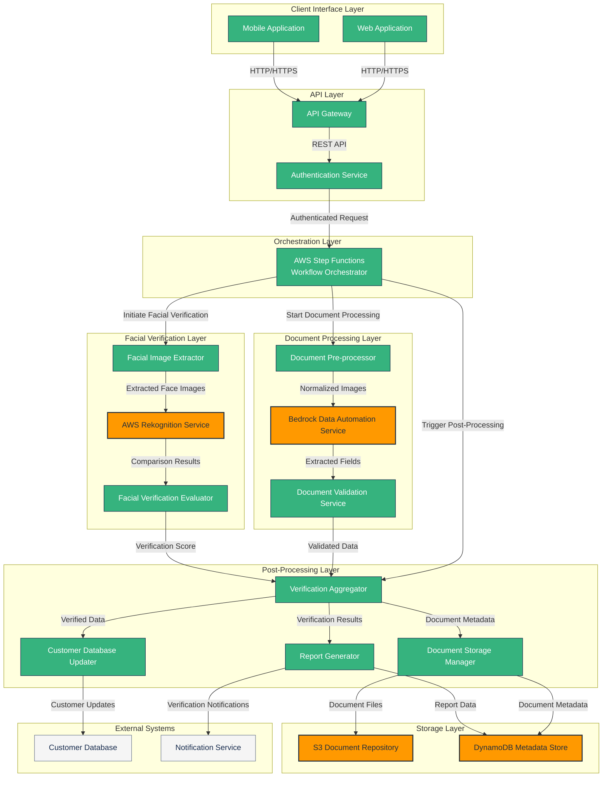

# Component Diagram: French Document Processing System

## System Component Architecture

The following component diagram illustrates the architecture of the French Document Processing System using AWS Bedrock Data Automation with pre-built templates. It shows the major system components, their interactions, interfaces, and key data flows.

## Component Descriptions

### Client Interface Layer
- **Web Application**: Browser-based interface for document upload, facial capture, and verification status checking
- **Mobile Application**: Mobile interface with similar functionality, including camera access for document and facial captures

### API Layer
- **API Gateway**: Manages API requests, authentication, and routing to appropriate services
- **Authentication Service**: Handles user authentication and session management

### Orchestration Layer
- **Workflow Orchestrator (Step Functions)**: Coordinates the entire document processing workflow, manages state transitions, and handles errors

### Document Processing Layer
- **Document Pre-processor**: Enhances image quality, normalizes document images, and performs initial quality checks
- **Bedrock Data Automation Service**: AWS service that uses pre-built templates to extract data from French official documents
- **Document Validation Service**: Validates extracted data against expected formats and business rules

### Facial Verification Layer
- **Facial Image Extractor**: Extracts facial images from identity documents and driver's licenses
- **AWS Rekognition Service**: Performs facial comparison between live photos and document photos
- **Facial Verification Evaluator**: Evaluates comparison results against FAR/FRR thresholds and determines verification status

### Post-Processing Layer
- **Verification Aggregator**: Combines results from document processing and facial verification
- **Report Generator**: Creates standardized verification reports for internal use
- **Customer Database Updater**: Updates the customer database with verified information
- **Document Storage Manager**: Manages document storage and metadata indexing

### Storage Layer
- **S3 Document Repository**: Secure storage for original documents with lifecycle management for GDPR compliance
- **DynamoDB Metadata Store**: NoSQL database for document metadata, verification results, and report data

### External Systems
- **Customer Database**: Existing database system that stores customer information
- **Notification Service**: System for alerting relevant personnel about verification results

## Data Flows

1. **Document Capture Flow**:
   - Client uploads document images via Web/Mobile interface
   - Images are authenticated, validated and routed to document preprocessing

2. **Document Processing Flow**:
   - Preprocessed images are sent to Bedrock Data Automation
   - Extracted data is validated against business rules
   - Validated data is forwarded to the verification aggregator

3. **Facial Verification Flow**:
   - Facial images are extracted from documents
   - Live portrait is compared with document photos using AWS Rekognition
   - Verification results are sent to the verification aggregator

4. **Post-Processing Flow**:
   - Verification results are compiled
   - Customer database is updated with verified information
   - Documents are stored in S3 with metadata in DynamoDB
   - Verification reports are generated
   - Notifications are sent to relevant personnel

## Interface Specifications

### API Interfaces
- **Client-to-API Gateway**: REST APIs for document upload, facial capture, and status checking
- **API Gateway-to-Services**: Internal REST APIs or Lambda function invocations

### Service-to-Service Interfaces
- **Orchestration-to-Processing**: AWS Step Functions task invocations
- **Inter-Service Communication**: Primarily event-based using AWS EventBridge

### Storage Interfaces
- **Service-to-S3**: AWS S3 SDK for document storage operations
- **Service-to-DynamoDB**: AWS DynamoDB SDK for metadata operations

### External System Interfaces
- **Customer Database Integration**: Custom integration layer based on database technology
- **Notification System**: SNS topics or custom API integration

## Security Boundaries

The component architecture implements security at multiple layers:
- API Gateway authentication and authorization
- IAM roles and policies for service-to-service communication
- Encryption for data at rest and in transit
- VPC isolation for sensitive processing components
- Data masking for personally identifiable information (PII)