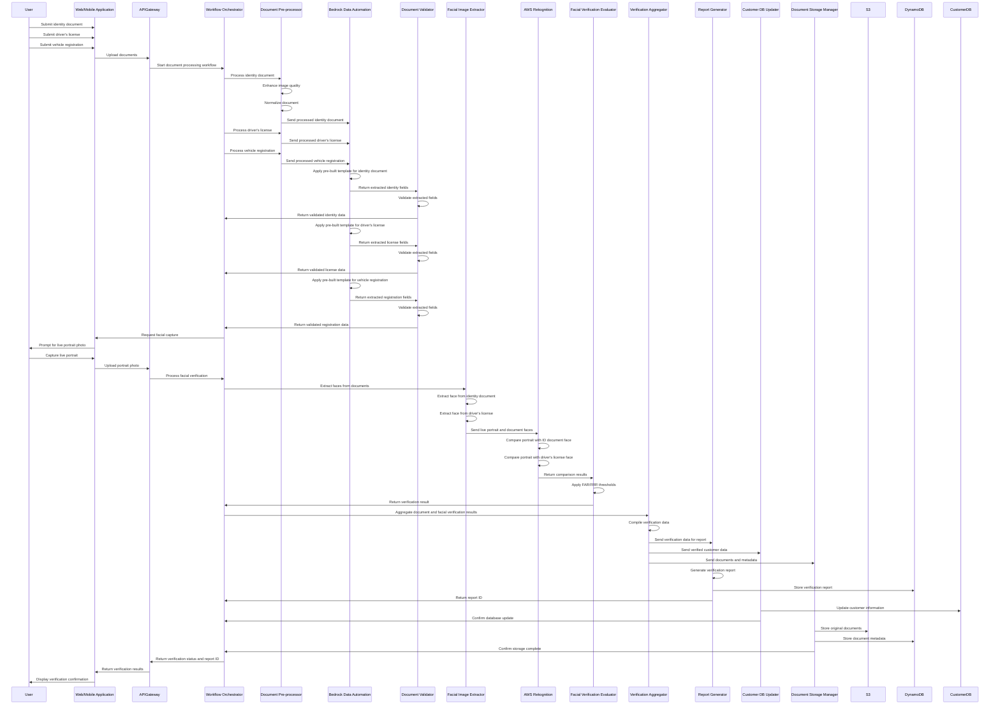
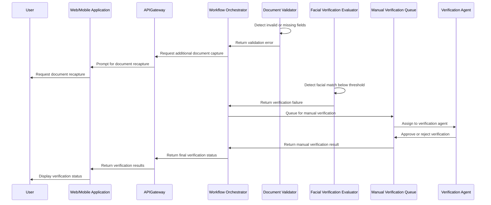
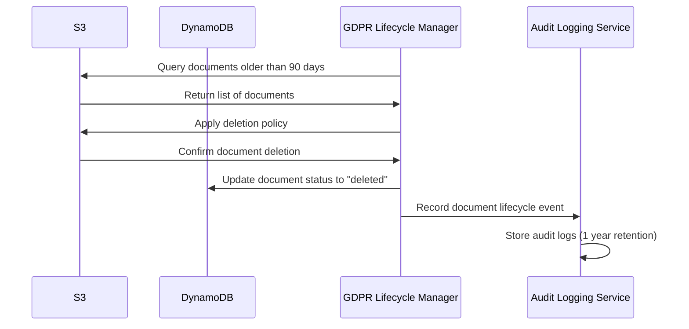

# Sequence Diagram: French Document Processing System

This sequence diagram illustrates the step-by-step interaction flow in the French document processing system using Bedrock Data Automation with pre-built templates. It shows the interactions between components during document capture, processing, facial verification, and final verification processes.

## Document Submission and Processing Flow

## Error Handling Flow

## Lifecycle Management Flow

## Summary of Key Interactions

1. **Document Processing Flow**:
   - User submits three document types through client application
   - Documents are pre-processed for quality enhancement
   - Bedrock Data Automation extracts data using pre-built templates
   - Extracted data is validated against business rules

2. **Facial Verification Flow**:
   - User provides live portrait photo
   - System extracts facial images from identity documents
   - AWS Rekognition performs facial comparison
   - Evaluator determines if verification passes based on thresholds

3. **Post-Processing Flow**:
   - Results are aggregated from document processing and facial verification
   - Verification report is generated and stored
   - Customer database is updated with verified information
   - Documents are stored with appropriate metadata
   - User receives verification confirmation

4. **Error Handling**:
   - Document validation errors trigger recapture requests
   - Failed facial verification routes to manual review
   - Final status is communicated to the user

5. **Lifecycle Management**:
   - Documents older than 90 days are automatically deleted
   - Metadata is updated to reflect deletion status
   - Audit logs are maintained for 1 year